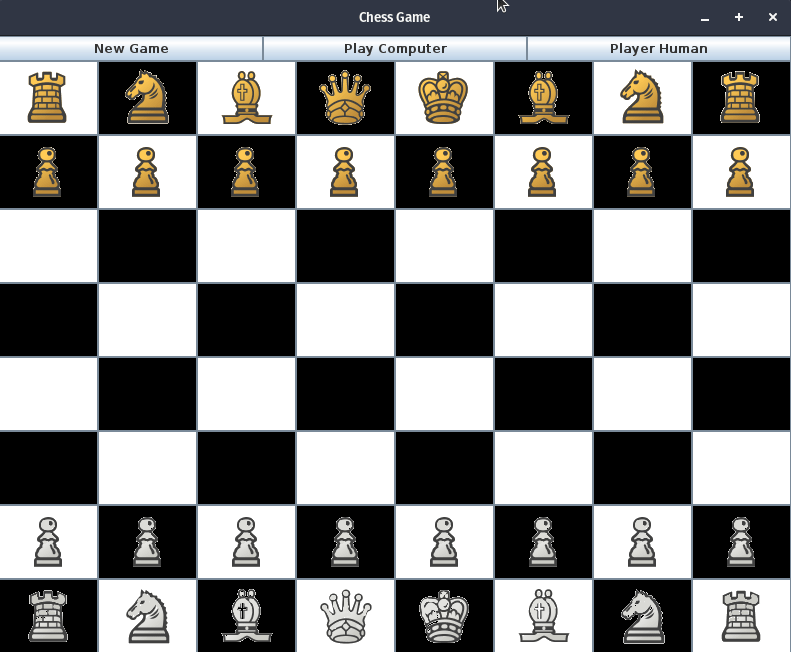

Chess Game, with a Graphical User Interface written in Java.
The game offers two modes, 1) vs. Human 2) vs. Computer

To run
------
All of the java files are in the source folder. Simply compile them with javac (or use any build tool you'd like)
and run InitiateProgram

Background 
----------
I wrote this program during my Sophomore year as a CS student. It was my first offical personal project. During 
the process of developing this chess program, I learned the basics of GUI event-driven programming,
the importance of the structure and architecture of a program as well as the communication between different 
objects (their data), recursion, and artificial intelligence.

The artificial intelligence started with random moves, but transitioned to the minimax algorithm with 
alpha-beta pruning. The engine thinks 4 moves ahead, and is not as fast as desired. The project taught
me the importance of algorithms, and how they drastically change the performance of run-time performance.
Not only this, but also how the the size of the data you manipulate with algorithms also makes a considerable
difference. 

Moving forward from this program, I applied better planning and more careful selection of algorithms / data
structures for my current projects.

Ending Note
-----------
Thank you for looking at my chess project. It was really fun to make, as it challenged me logically (rules of chess),
and graphically (first GUI).

Please let  me know if there are any bugs, or if you have any questions. 
